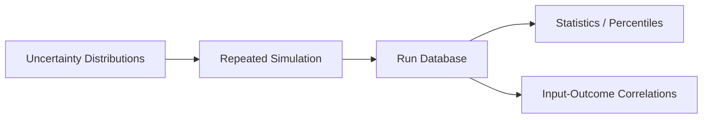

# Monte Carlo Mission Analysis Lab

Synthetic aerospace uncertainty-analysis project that runs repeatable Monte Carlo experiments for a fictional research flight profile.

## Features

- Seeded uncertainties in mass, drag, wind, and sensor bias
- Simple climb/cruise energy model
- Success criteria based on altitude, fuel reserve, and navigation error
- Percentiles, mean/stddev, and sensitivity-style correlations
- CSV run database, JSON report, tests, and CI



## Run

```bash
python monte_carlo.py --runs 500 --seed 42 --output artifacts
python -m unittest discover -s tests -v
```

All inputs are fictional and intended only to demonstrate simulation analytics and reproducibility.