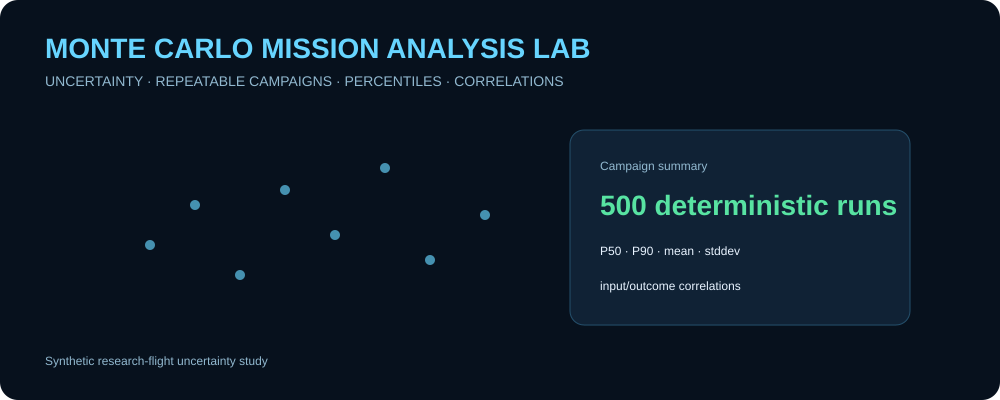
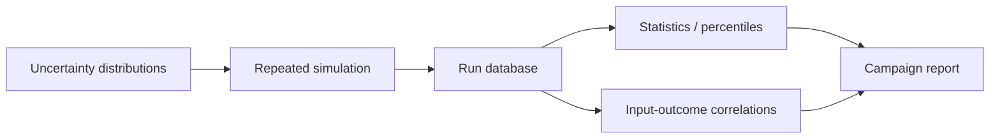

# Monte Carlo Mission Analysis Lab

  

A runnable synthetic aerospace uncertainty-analysis project that executes **repeatable Monte Carlo campaigns** for a fictional research-flight profile. It disperses model inputs, records each run, computes percentiles and failure statistics, and ranks simple input/outcome correlations.

> All inputs, criteria, and models are fictional and intended only to demonstrate simulation analytics and reproducibility.

<p align="center"></p>

## Features

- deterministic seeded campaigns
- uncertainties in synthetic mass, drag, wind, and sensor bias
- simple climb/cruise energy model
- transparent demonstration success criteria
- run-level CSV database
- JSON campaign summary
- mean and standard deviation metrics
- percentile metrics
- success/failure counts
- sensitivity-style input/outcome correlations
- unit tests and GitHub Actions CI

## Architecture



## Quick start

```bash
git clone https://github.com/skytruong90/Monte-Carlo-Mission-Analysis-Lab.git
cd Monte-Carlo-Mission-Analysis-Lab
python monte_carlo.py --runs 500 --seed 42 --output artifacts
```

Run tests:

```bash
python -m unittest discover -s tests -v
```

## Outputs

The CSV run database stores every sampled input and corresponding mission outcome so statistics can be recomputed later without rerunning the campaign. The JSON report captures configuration, pass/fail counts, key percentiles, moments, and correlation coefficients.

## Experiment design

Each run receives a deterministic child sample from the campaign random-number generator. The simple flight model converts dispersed parameters into synthetic altitude, resource/fuel reserve, and navigation-error outcomes. Demonstration success criteria are then applied consistently to all runs.

The intent is to show the **analysis pipeline around Monte Carlo simulation**, not to represent a real vehicle.

## Validation strategy

Tests verify repeatability for the same seed, differences across seeds, valid distributions, percentile ordering, result counts, correlation bounds, and report generation. CI executes the suite and a short Monte Carlo smoke campaign.

## What I learned / demonstrated

- why a Monte Carlo run database is valuable for post-processing and traceability
- how deterministic seeds make probabilistic campaigns reproducible
- why percentiles can communicate tail behavior better than mean/stddev alone
- how simple correlations can identify candidate uncertainty drivers for deeper analysis
- why success criteria and uncertainty distributions must be explicit configuration, not hidden assumptions

## Limitations

The simulation and success criteria are intentionally simplistic. Correlation does not establish causation or nonlinear sensitivity, and this project does not implement Latin hypercube sampling, Sobol indices, correlated uncertainties, surrogate modeling, convergence analysis, or validated flight-performance models.

## Public-data disclaimer

All data and parameters are synthetic and public-safe.